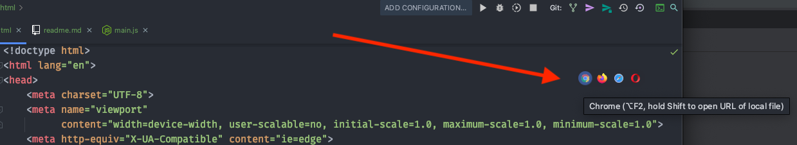

# Setup

- Project klaarzetten in localhost
- Webstorm layout (optioneel)

<br>
<br>


# Localhost

Maak een nieuw `index.html` bestand en open het in webstorm. Typ `!` + TAB. Je krijgt nu automatisch een leeg default html bestand.

## XAMPP

Start XAMPP en plaats je project in de `htdocs` folder. Je kan nu je `index.html` bekijken door je project te openen in ***Localhost***. Je url is dan bijvoobeeld:

```
http://localhost/prg03/test/index.html
```

⚠️ Let op! Open je project nooit via `file://c:/mijn documenten/index.html`!

## Webstorm Live Reload

In webstorm kan je een ***quick preview*** openen met de browser buttons rechtsbovenin beeld.



De url ziet er dan zo uit. Dit werkt alleen zo lang webstorm open staat.

```
http://localhost:8000/
```

Maak een nieuw `style.css` en `script.js` bestand en laad deze in je html:

```html
<head>
    <link rel="stylesheet" href="./css/style.css">
</head>
<body>
    <script src="./js/script.js"></script>
</body>
```
🤯 Webstorm update automatisch je HTML en CSS in het localhost adres. Dit is handig tijdens development. 

[Als je ***javascript*** ook automatisch wil updaten kan je dat aanzetten via settings.](https://www.jetbrains.com/help/webstorm/live-editing.html)

## Browser console

Klik met rechts in het browservenster en kies **inspect**. Open de console tab. 

---
<br>
<br>
<br>
<br>

# Webstorm settings

🖖 Deze instellingen zijn optioneel! Kijk zelf wat je een prettige manier vindt om in je code editor te werken.

### Disable function parameter hints 


### Zoom met muiswiel


### Javascript live update

- [live update settings](https://www.jetbrains.com/help/webstorm/live-editing.html)

### Code font ligatures


### Wel of geen puntkomma aan het einde van een regel


### Cleaner code view

- Toon ***Project Files*** in plaats van ***Project***
- Verberg vensters die je niet gebruikt onder ***View > Appearance***


### Weg met die verticale lijn


## Material UI theme

Installeer de Google Material UI theme via Settings > Plugins


https://plugins.jetbrains.com/plugin/8006-material-theme-ui
